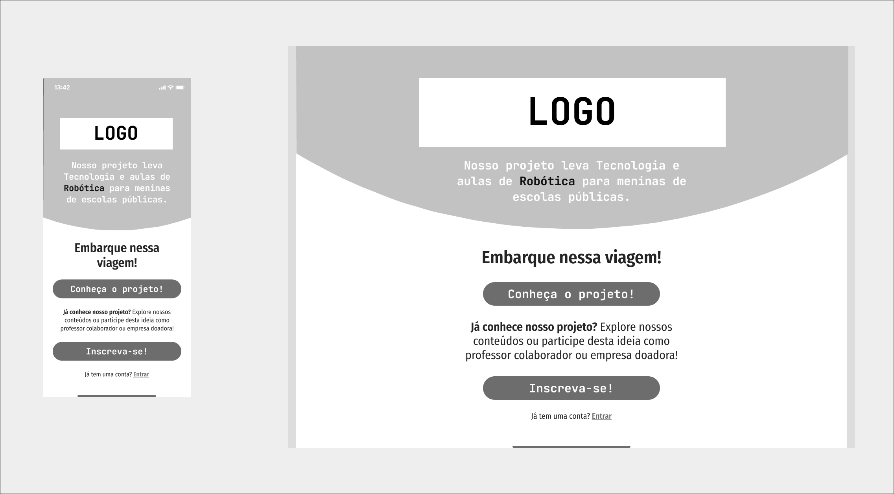

# Projeto de Interface

O projeto de interface do website *Meninas, ativar!* foi desenvolvido com um design simples e telas leves. O site é responsivo, com poucos elementos gráficos, a fim de que fosse adaptável a diversas telas e navegadores. Com navegação fácil e cores marcantes, sua interface é agradável, atraente e eficiente, não sendo necessárias muitas instruções para utilizá-la.

## User Flow

Abaixo, segue o fluxo do usuário em suas principais funções:

## Wireframes

As telas deste projeto não possuem muita diversidade, tornando sua estrutura extremamente simples e familiar.

### Tela Inicial

A tela Inicial apresenta as funções básicas do website: Conhecer o projeto e Inscrever-se com algum tipo de perfil.

### Área do Usuário (Aluna, Professor Usuário e Professor Colaborador)

Ao se logar, os perfis Aluna, Professor Usuário e Professor Colaborador terão como tela principal ao logar a tela abaixo:

