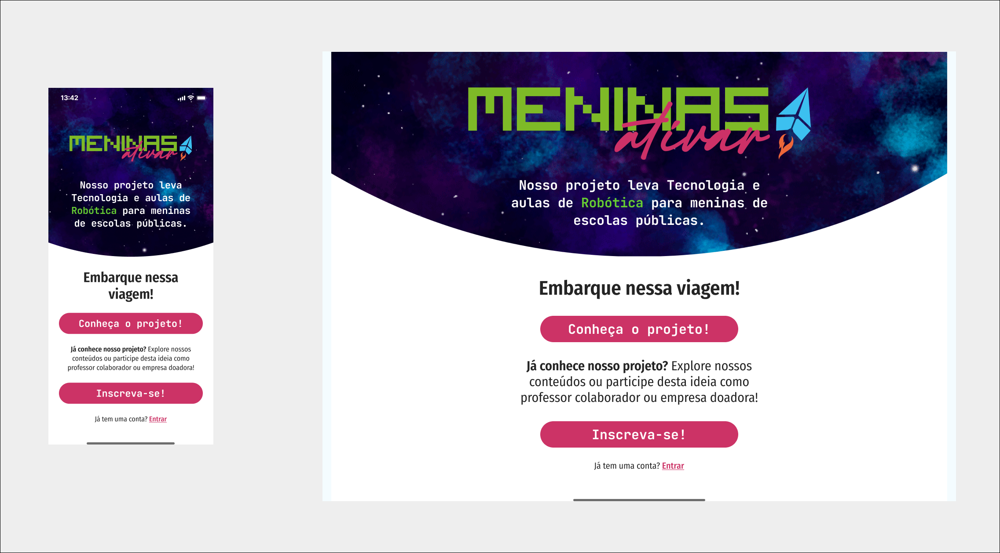
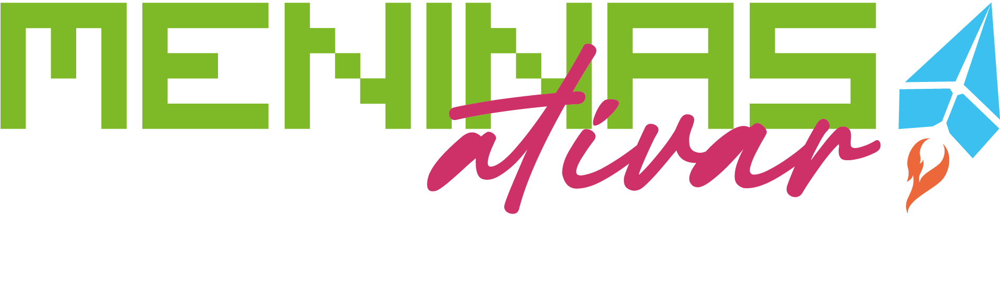
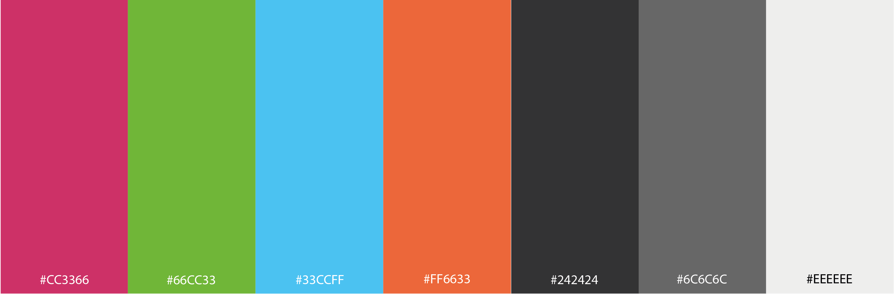
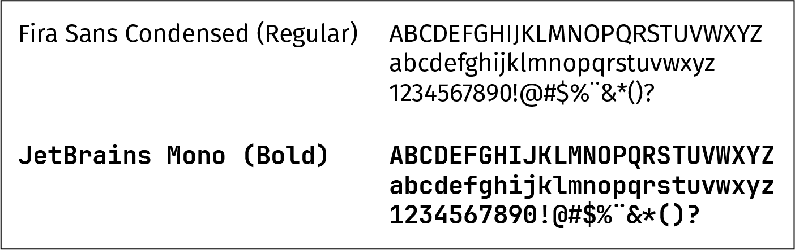
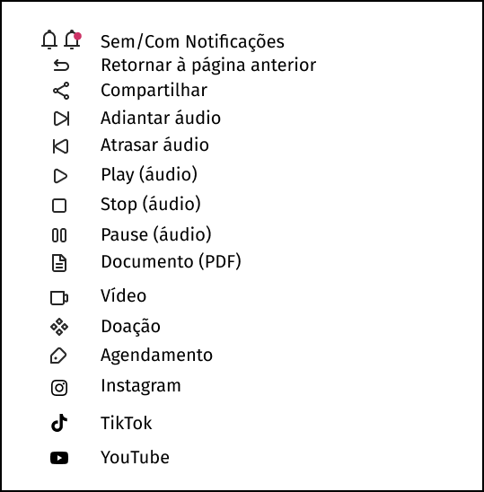

# Template padrão do site

## Design

O logo do projeto utiliza as referências de um aviãozinho de origami funcionando como um foguete. Utiliza as quatro cores fortes da paleta de cores

O logo utiliza as fontes abaixo, remetendo à tecnologia e às meninas.

## Cores
A paleta de cores do site se baseia nas quatro cores do logo, mais tons auxiliares de cinza para fonte, boxes e ícones. A cor principal é o #CC3366, usado para os botões, links e algumas estruturas.

## Tipografia
A tipografia utilizada para o site é a Fira Sans Condensed (Regular, Light, Semibold, Italic) para os textos em geral e JetBrains Mono (Regular) para botões com texto.

## Iconografia
A iconografia utilizada pertence à família IconaMoon 1.1.

